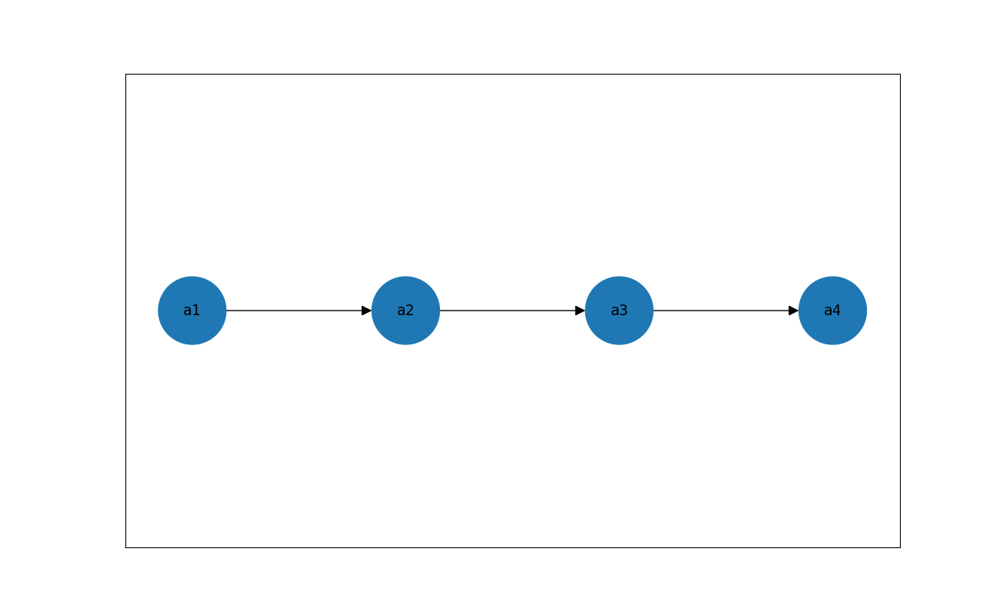
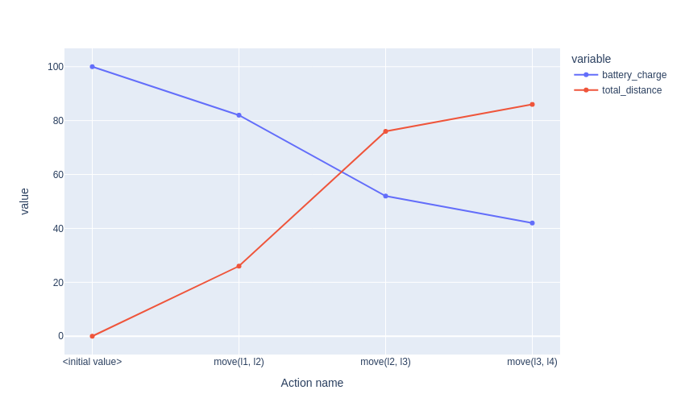
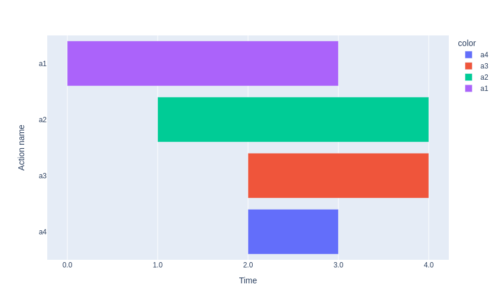
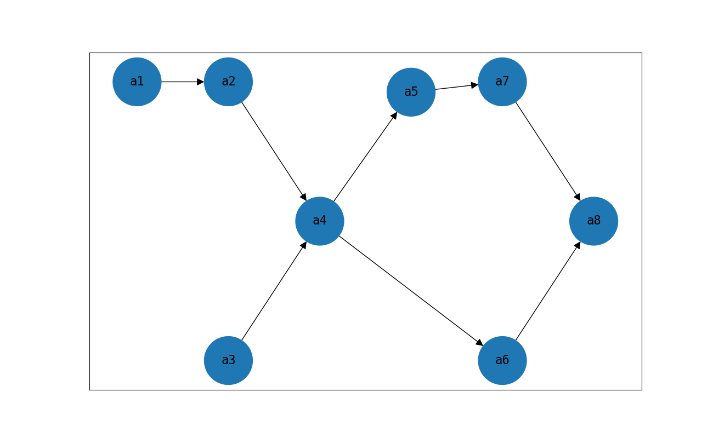
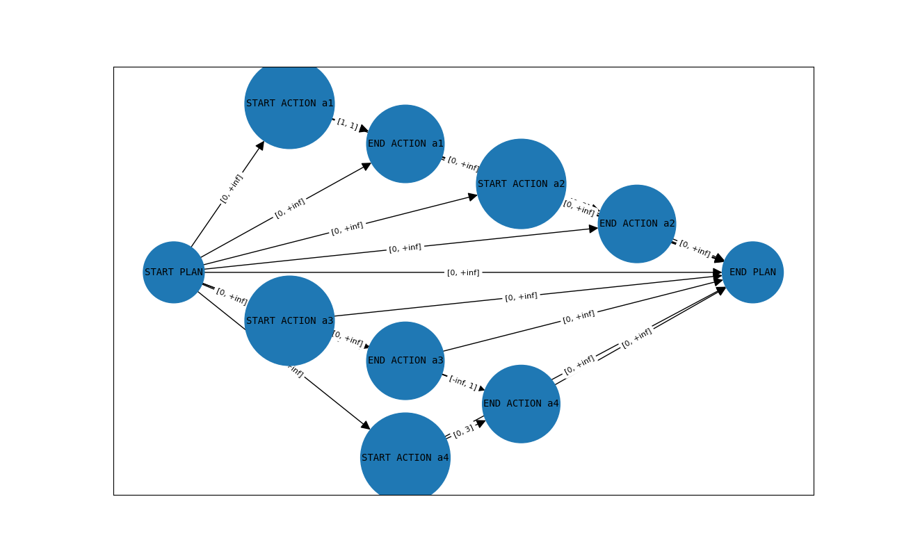
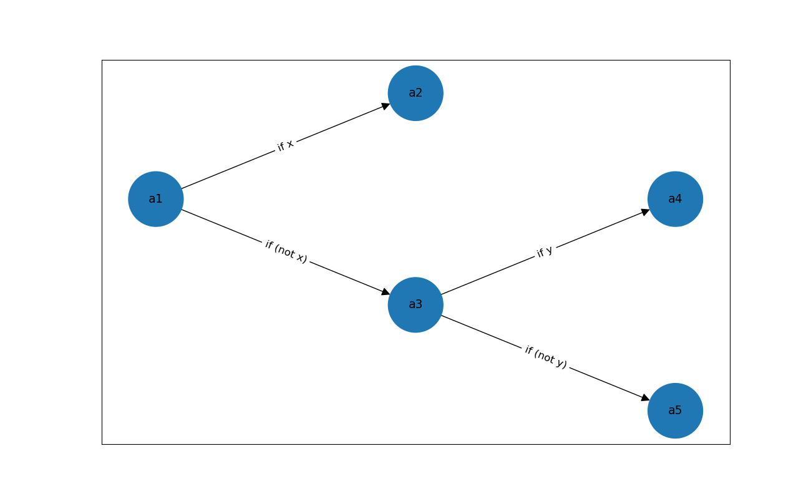
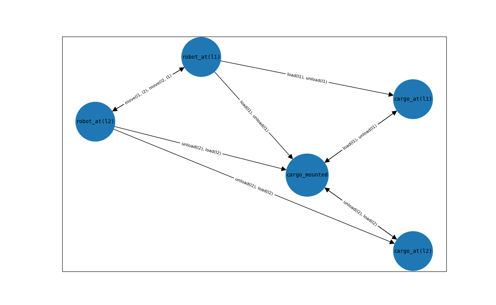

Plot Package
============

The `up.plot` package contains some high level methods to plot:
* The plans
* The variation of one or more (boolean or numeric) expression and quality metric values during a `SequentialPlan`
* The causal graph of a Problem

Imports
-------

Here are the imports needed for the following examples:

.. literalinclude:: ./code_snippets/plot.py
    :lines: 1-37

SequentialPlan Example
----------------------

A SequentialPlan is simply a sequence of actions.

.. literalinclude:: ./code_snippets/plot.py
    :lines: 70-73
    :emphasize-lines: 4

Plotting fluents in SequentialPlan
----------------------------------

On a SequentialPlan, if the `UPSequentialSimulator` supports the `Problem`,
the value of some arbitrary expressions or the value of some quality metrics can be plotted.
This shows how the value changes during the plan.

Only numeric or boolean expressions can be plotted.

Define the problem:

The problem defined is a robot that moves from `l1` to `l4`, passing through `l2` and `l3`.

While moving, the battery decreases based on the distance from the locations and the total distance accumulates.

Note: the problem has specified only the parts interesting for this simulation. It's not a complete problem to give to a planner.

Plot the value of the battery and the total distance during the plan simulation.

.. literalinclude:: ./code_snippets/plot.py
    :lines: 76-123
    :emphasize-lines: 48

TimeTriggeredPlan Example
-------------------------

A `TimeTriggeredPlan` is a sequence of 3 items. Every items is composed by an action,
the time in which the action starts, and, if the action is a `DurativeAction`, the
action duration.

.. literalinclude:: ./code_snippets/plot.py
    :lines: 126-136
    :emphasize-lines: 11

Partial Order Plan
------------------

A `PartialOrderPlan` is a directed graph where the nodes are `ActionInstances` and
the edges create an ordering between 2 actions.

In the unified_planning, a `PartialOrderPlan` is created with the adjacency list.

Generally speaking, a SequentialPlan is a specific case of a `PartialOrderPlan` where
every action has only one possible action that must be done before and one action that
must be done later.

.. literalinclude:: ./code_snippets/plot.py
    :lines: 139-154
    :emphasize-lines: 16

STNPlan Example
---------------

An `STNPlan` represents the temporal constraints from the events that must be performed
during the plan.

An event is either the start of the plan, the end of the plan, the start of an action or
the end of an action.

It is represented as a directed graph, where the nodes are the events.

There is an edge from the node `N` to the node `M` if `N` and `M` have a relative temporal
constraint.
The edge is labeled with 2 numbers, the `lower bound` and the `upper bound` to the time
that can elapse from `N` to `M`.

For example: `N --[0, 7]--> M` means that `M` must happen after -or at the same time, since
0 is included- `N`, but no more than 7 time units later.

.. literalinclude:: ./code_snippets/plot.py
    :lines: 157-187
    :emphasize-lines: 31

Contingent plan Example
-----------------------

A `ContingentPlan` is represented as a decision tree. Some actions can sense the initially
unknown value of one or more fluents and decide which action to perform next based on the
sensed values.

It is represented as a directed graph, with the nodes containing the action to perform and
the edges labeled as the expression that must be `True` in order to take that branch.

.. literalinclude:: ./code_snippets/plot.py
    :lines: 190-203
    :emphasize-lines: 14

Causal Graph
------------

The causal graph of a problem shows how the different (grounded) fluents of the problem are
interwined by the actions.

Every node of the graph is a fluent and there is an arc from `F1` to `F2` if there is an action
in the problem that reads `F1` and writes `F2`. If an action writes both `F1` and `F2` the arc from
`F1` to `F2` will be bidirectional.

The edge labels are the actions that use both fluents.

Define the problem:

The problem has a cargo at `Location l2` that must be moved by a `robot` to a `Location l1`.

.. literalinclude:: ./code_snippets/plot.py
    :lines: 206-259
    :emphasize-lines: 53-54

