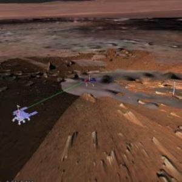

# Planetary Exploration

## Context

The ‘Planning for Space’ use-case targets the automation of the tactical planning process in the context of multi-asset human-robotic missions as prepared by the National Space Agencies, the European Commission and the European Space Agency. Typical examples are the [ExoMars](https://www.esa.int/Science_Exploration/Human_and_Robotic_Exploration/Exploration/ExoMars/ExoMars_rover) mission for Mars exploration and the Argonautes mission for moon exploration and exploitation.

The objective of the Space domain TSB is to provide an end-to-end system for:

- Producing automatically validated Partial Activity Plans from a set of goals provided by the operator,
- Producing Consolidated Activity Plans to be uploaded to the robotic system for execution. A Consolidated Activity Plan is defined as an aggregation of Partial Activity Plans proposed by geographically distributed teams of engineers and scientists participating in the mission,
- Integrate the resulting system into the ESA/TRASYS 3DROCS Space Robotics Ground Control Station (GCS),
- Validate the end-to-end system on real examples as foreseen in the ExoMars mission.

## Planning Problem Description

The planning problem in question revolves around a rover designed for Mars exploration, serving as the central agent. This Mars rover exhibits a versatile range of capabilities, enabling it to engage in various activities and tasks essential for scientific research and exploration on the Martian surface. The primary objective is to construct a sequential plan that outlines a series of actions the rover must undertake to achieve a specific mission goal. The complexity of this planning task is compounded by the presence of mission timelines and deadlines, closely tied to specific communication windows with Earth, where the rover must transmit data and receive instructions. Furthermore, the rover must manage its limited resources, such as battery power and available data storage, adding an additional layer of complexity. The mission's overarching goal is framed as a partial plan, necessitating planning to transform it into a fully executable and successful mission on Mars.

## Modeling in UP

The modeling in the unified-planning library of this problem employed all the different types of fluents to accurately represent the rover's state and the status of its subsystems. To capture the state of these subsystems, boolean fluents and user-defined types were used, enabling a precise representation of the robot's condition. Additionally, numeric fluents were employed to represent and manage essential resources, such as battery power and storage space, within the rover. To address the unique nature of the mission's goal, extra fluents were introduced to capture the partial plans that needed to be completed for mission success.

To provide a flexible and adaptable approach to planning, two planning models were constructed at different levels of abstraction. The more detailed model adopted a temporal planning approach, utilizing DurativeActions to account for the time required for various tasks and actions. This model was subsequently abstracted into a numerical planning model, where all actions were considered instantaneous (InstantaneousAction). This simplification was based on the assumption that, in the current system, robotic tasks could not be effectively parallelized.

In an experimental iteration of the model, SimulatedEffects were explored as a means to represent resources that required external evaluation through a "Rehearsal-As-A-Service" tool. This allowed for a more dynamic representation of resource management within the planning framework, adapting to the complexities and uncertainties of Mars exploration. However, this version turned out to be too computationally expensive.

## Operation Modes and Integration Aspects

Several Operation Modes were used to facilitate different aspects of the planning and execution process. One such mode is `OneshotPlanning` which serves as the primary approach for generating plans. This mode allows the system to efficiently determine a feasible plan to accomplish specific mission objectives, ensuring that the rover's tasks and actions are executable and optimized.

To further enhance the planning process, the `SequentialSimulator` mode was introduced. This mode was used in an approach where goals are serialized, and the simulator is invoked between calls to the Oneshot Planner. By simulating the outcome of each planning phase, the initial state is updated accordingly for the subsequent call to the planner.

Moreover, the `PlanValidation` was exploited: this operation mode allows for the validation of manually defined plans, ensuring they meet predefined criteria and constraints. Users can leverage this mode to verify that their plans align with mission objectives and do not violate critical constraints, thereby enhancing the overall success and safety of the Mars rover mission.

This software bridge was successfully integrated into an operational environment for supporting the tactical activity planning of rovers targeting robotic planetary exploration. The operation modes were easily wrapped in a service callable by 3DROCS using REST API.

## Lessons Learned

In solving this use case, we've learned that expressiveness in problem modeling comes at a cost and can slow down the planning process. Keeping things simple and straightforward, striking a balance between detail and simplicity, is a more effective strategy for finding solutions in shorter, more efficient timeframes. This approach has allowed us to enhance the adaptability of the planning system to the needs of the use case.

## Resources

- [Planning for Space page](https://www.ai4europe.eu/business-and-industry/case-studies/planning-space)
- TSB for the Space Use Case. [Github](https://github.com/aiplan4eu/tsb-space)
