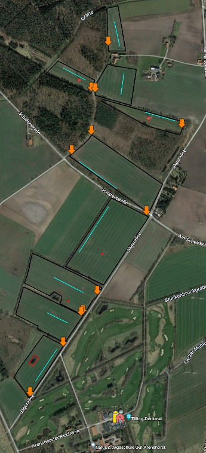
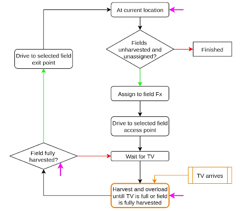
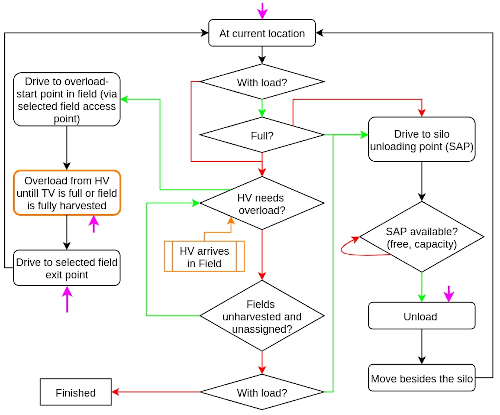
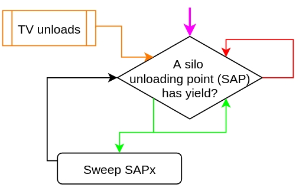

# Agriculture: Silage Maize Harvest

## Context

During silage-maize harvest, a non-capacitated harvester harvests the yield from a field. Because these machines have no bunker, one or more transport vehicles are used to receive the harvested yield from the harvester while the harvester is working (i.e., 'on the run' yield overload). The harvested yield is later transported to a silo for storage. In a day campaign, n fields (n>0) must be harvested by m harvesters (n>=m>0) being assisted by k transport vehicles (k>0). Due to the high costs associated to machines and labor, it is important that the process is optimized coordinating the machine tasks in a way that minimizes the duration of the campaign and leads to reductions on harvester idle times, reductions of fuel consumption, etc.

The process can be analyzed from the perspective of the harvesters and the transport vehicles.

* #### Harvester:

  * An unharvested (or partially harvested) field is assigned to a harvester. 

  * The harvester drives to the one of the access-points of the assigned field.

  * The harvester waits for a transport vehicle to start harvesting and overloading the yield until the transport vehicle is full or the field is fully harvested.

  * If the transport vehicle got full and the field is not fully harvested, the harvester will wait until a transport vehicle arrives to continue with the harvest; otherwise, the field is fully harvested, hence the harvester will exit the field via one of the access-points and wait for another field to be assigned to it (if any).

    

    

    

* #### Transport vehicle (TV):

  A transport vehicle (TV) can perform two operations: a) drive to a field to assist a harvester (only if the transport vehicle is not full and the harvester still needs assistance to complete the field); or b) drive to a silo and unload the yield (only if there is yield in its bunker to be unloaded)

  **a) Assist harvester (overload)**

  * The TV drives to one of the access-points of the corresponding field
  * The TV drives to the location (inside the field) where its overloading window will start and, if needed, waits for the harvester to start overloading
  * The TV drives behind/along-side the harvester while the harvester harvests and overloads the yield into the TV's bunker.
  * Once the TV is full or the field is fully harvested, the TV exits the field via one of the access-points. 
  * If the TV is full, it will have to drive to a silo to unload the yield; otherwise, it can either drive to a silo to unload the yield or go assist a harvester in another field.

  **b) Unload at silo**

  * The TV drives to a silo access (unloading) point (SAP). The silo must have enough overall capacity to receive/store the yield in the TV's bunker.
  * Wait (near the SAP) until the SAP is available and has enough capacity for the TV to unload all the yield in its bunker.
  * The TV unloads the yield at the SAP
  * The TV is free to assist a harvester with an empty bunker

  

  

  

At the moment, a simplified version of the process at the silo is considered. In this simplified version, the yield unloaded at the silo's access/unloading points (SAPs) is immediately transferred into the general silo storage location. The silo's SAPs have infinite capacity, and they can be used by several transport vehicles simultaneously. In the more complex version, each SAP has a capacity and can only be used by one TV at a time. The yield unloaded in a silo's SAP is transferred to the silo's (main) storage area by one or more compaction vehicles assigned to the silo. These compactors can sweep a certain amount of yield in each tour, hence restoring the SAPs capacity so that other TVs can unload there in the future. 

* #### Compactor:

  * Wait until a silo access/unloading point (with yield) is assigned to it. 
  * Sweep the SAP, transferring yield from the SAP to the silo storage location. 
  * After the sweep, the compactor is free to be used to sweep a SAP. 

  

## Planning Problem Description

The goal is to plan the harvesting of the given fields with the given resources (harvesters, transport vehicles, silos) in a way that the campaign duration is minimized. The planning must consider the capacity constraints of the problem (i.e., the amount of yield in the fields and the capacities of the silos and TVs bunkers), the synchronization between harvesters and TVs during harvesting and overloading, and the duration of the different activities (transit outside the field between locations, transit inside of the fields, harvesting/overloading, unloading at the silo). At the end of the campaign, all fields must be harvested, and all the yield must be located at the silos.

Because the problem for a campaign is defined based on some estimations and assumptions (e.g., average yield mass in the fields [t/ha], constant/fixed machine transit speed and harvester working speeds, etc.), significant deviations to these values could make the generated plan infeasible after some time during the actual harvesting campaign. This is also the case when the actual execution deviates from the plan, e.g., if a TV takes a longer path to the silo; a TV selects another silo to unload or harvester to assist; a machine has a failure and has to be removed or exchanged. Hence, it must also be possible to re-plan started/incomplete campaigns, based on the current field, machines and silos states. 

## Modeling in UP

Given the required synchronization between machines and the time-dependent conditions and effects, the silage maize harvest represents a temporal planning problem. However, some adjustments were made to the problem definition to also represent the problem as a sequential planning problem  (with some limitations), by internally managing action durations, synchronization conditions, and computed timestamps via fluents. Therefore, two versions were developed, one for temporal planning and one for sequential planning. 

The TSB provides a group of settings that allows the user to control some aspects of the problem definition. The main settings correspond to the problem type (either temporal or sequential), and the types of the effects that will be added to the actions.

The following table shows some of the main UP features used by both planning approaches.

| Feature                                                      | Temporal planning | Sequential planning |
| ------------------------------------------------------------ | ----------------- | ------------------- |
| ***General***                                                |                   |                     |
| PROBLEM_CLASS                                                | ACTION_BASED      | ACTION_BASED        |
| Action type                                                  | DurativeAction    | InstantaneousAction |
| Plan type                                                    | TimeTriggeredPlan | SequentialPlan      |
| ***Fluents and numbers***                                    |                   |                     |
| NUMERIC_FLUENTS, OBJECT_FLUENTS                              | X                 | X                   |
| CONTINUOUS_NUMBERS, DISCRETE_NUMBERS                         | X                 | X                   |
| BOUNDED_TYPES                                                | [optional]        | [optional]          |
| ***Effects***                                                |                   |                     |
| Normal effects (FLUENTS_IN_BOOLEAN_ASSIGNMENTS, FLUENTS_IN_NUMERIC_ASSIGNMENTS) | [optional] (1)    | [optional] (1)      |
| SIMULATED_EFFECTS                                            | [optional] (1)    | [optional] (1)      |
| CONDITIONAL_EFFECTS                                          | [optional] (1)    | [optional] (1)      |
| ***Conditions***                                             |                   |                     |
| DISJUNCTIVE_CONDITIONS, EQUALITIES, NEGATIVE_CONDITIONS      | X                 | X                   |
| ***Time and duration***                                      |                   |                     |
| TIMED_GOALS, TIMED_EFFECTS                                   | X                 |                     |
| INTERMEDIATE_CONDITIONS_AND_EFFECTS                          | X                 |                     |
| CONTINUOUS_TIME                                              | X                 |                     |
| STATIC_FLUENTS_IN_DURATIONS, FLUENTS_IN_DURATIONS            | X                 |                     |
| ***Quality metrics***                                        |                   |                     |
| MAKESPAN                                                     | [optional] (2)    |                     |
| FINAL_VALUE (MinimizeExpressionOnFinalState)                 |                   | [optional] (2)      |

**Notes:**

1) The following options are available to add the problem action effects: 
   * WITH_ONLY_SIM_EFFECTS (default): All effects are simulated effects
   * WITH_ONLY_NORMAL_EFFECTS: All effects are normal effects (no simulated nor conditional effects)
   * WITH_NORMAL_EFFECTS_AND_SIM_EFFECTS: If a normal effect is given with a proper value, this effect will be used for the respective fluent; otherwise the value for the fluent must be set via simulated effects.
   * WITH_ONLY_SIM_EFFECTS_WHERE_NEEDED: If all effects at a certain timing can be done without simulated effects or conditional effects, normal effects will be used; otherwise, all effects of that timing will be simulated effects.
   * WITH_NORMAL_EFFECTS_AND_CONDITIONAL_EFFECTS: Only normal and conditional effects will be used (no engines that supports the other features also support conditional effects, hence it was not tested)
2) No engines that supports the other features also support quality metrics, hence it was not tested.

To synchronize the tasks performed by the machines (e.g., drive a TV to a field and wait for the respective overload activity, harvest the field while overloading from a harvester to the assigned transport vehicle, drive the TV to a silo and download), `DurativeActions` were used in the temporal problems, where the durations of such actions are either fixed or computed based on the current fluent values (e.g., current location of the machine, machine speed, and transit distance to the goal location for driving-related actions; current amount of yield in the TV bunker and TV unloading rate for unload-related actions; etc.). In the case of sequential planning, the problem actions were modified and decoupled, using `InstantaneousActions` together with extra control fluents to manage the synchronization and action durations internally. The proper management of fluents via action effects and conditions allow solving the planning problem taking into consideration the problem requirements and constraints. It is important to note that not only the actions differ between the temporal and sequential planning approaches, but also the fluents used: some fluents are used in both approaches, whereas others are specific to the planning type.

The management of resources (availability, capacity constraints, etc) are managed using boolean, numeric and `UserType` fluents. Boolean and numeric fluents are used to keep track of constant values (e.g., distance between locations, TV total bunker capacities) and object states (e.g., current TV bunker mass, yield mass remaining at the field, whether the field is completely harvested). The following `UserTypes` were introduced: `Harvester`, `TransportVehicle`, `Field`, `FieldAccess`, `Silo`, `SiloAccess`, `MachineInitLoc`, and `Compactor` (not used at the moment). These user types are used thoughout the planning process to keep track of facts such as whether a machine is at a specific location (`Field`, `FieldAccess`, `SiloAccess`, `MachineInitLoc`), or which harvester has been assigned to a field.

Moreover, intermediate effects were used in the temporal planning approach to specify important events within actions composed by more than one task. For example, an action `do_overload_and_exit` is composed by the TV tasks 'harvest and overload' and 'exit the field when the overload is finished', hence there will be an intermediate event 'overload finished' within the duration of the action, which enables the next TV to start to overload to before the current TV reaches the field exit. 

Finally, custom heuristics were developed to improve the planning times and the quality of the resulting plans, and are specific to the planning approach. By using custom heuristics it is possible to influence the actions selected by the planning engine, for instance, by selecting actions that decrease the amount of unharvested yield and/or increase the amount of yield stored in the silos. Additionally, for temporal planning, it is also possible to add cost-windows similar to the aforementioned control windows, which will enable to add extra costs in the heuristic functions for actions that are not planned timely. For example, if a TV arrives to the field and it is waiting to overload, and the overload from the harvester does not start within a given time (ɛ seconds after the TV arrives to the overloading start location), a penalty cost is added to the costs returned by the heuristic function. This will, for instance, make the planner send a TV to assist a harvester that is waiting to overload instead of sending it to assist a harvester that has already a queue of TVS waiting to overload.

## Operation Modes 

Several Operation Modes offered by the UP framework were used:

* **`OneshotPlanning`**: this is the main approach to generate plans offered by UP, which allows the user to either select the planning engine to be used, or let the system determine which of the available engines is suitable for the given problem based on the problem type and features.
* **`PlanValidation`**: this operation mode was used to validate plans generated by UP, and plans generated 'manually' (i.e., automatic creation of plans without using UP planning engines).
* **`SequentialSimulator`**: this operation mode enabled the 'manual' creation of sequential plans. It was also used to decode sequential plans and inspect the process, machine, field, and silo states throughout the plan.
* **`Compiler`**: this operation mode was tested to create other versions of the problem by removing problem features (e.g., `USERTYPE_FLUENTS_REMOVING`) that are not supported by some planning engines. However, to cope with the removal and problem requirements and constraints, the compilers often needs to introduce other features into the new version of the problem, which, in our case, were not supported by the planning engine either. 

## Lessons Learned

* **Know the available planning engines**: The UP framework allows to build complex problems offering several types of actions, fluents, effects, conditions, goals, optimization, etc. However, the planning capabilities are restricted by the features offered by each engine. Building a valid problem in UP does not guarantee that the problem can be solved by one or more of the available planning engines. It is therefore advised to check the features offered by all available engines, analyze what engines are more suitable for the problem, and design the problem according to the engines’ supported features.

* **Simple is better**: Even though the UP framework offers a large variety of features, the simpler the problem is, the better. Reducing the amount of problem actions might improve the planning performance. Defining the problem with the minimum required features (e.g., regarding fluent or effect types) increases the chances to find more engines that can support it. 

* **Custom heuristics**: For some problems it can be helpful to use custom heuristics in order to speed up the planning time by translating the knowledge specific to the problem into such custom heuristics. This allows the user to guide the planning engines in the right path, potentially decreasing planning times and yielding better/preferable plans.  

  

## Resources

- [Maize harvesting case study page](https://www.ai4europe.eu/business-and-industry/case-studies/campaign-planning-silage-maize-harvesting)
- TSB for the Agriculture Use Case. [Github](https://github.com/aiplan4eu/tsb-agriculture)
