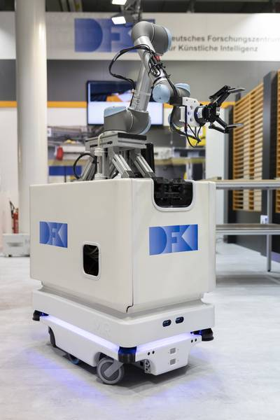

# Service Robot (Mobipick)

## Context

This use-case demonstrates sample tasks of the service robot [Mobipick](https://github.com/DFKI-NI/mobipick) that operates in the context of human-robot collaboration.
Mobipick consists of a MiR base, a UR5 arm and a Robotiq gripper attached to the arm. Mobipick runs ROS as its middleware, and its capabilities and actions are implemented in [ROS](https://ros.org) or use the ROS ecosystem.

The mobile robot can sense, navigate and manipulate its environment, to pick up and bring objects to specified locations. It can navigate the mapped world autonomously avoiding dynamic obstacles using the laser scanners of its mobile base. Additionally, it is able to classify objects and estimate their 3D poses using a camera attached to the robot's end effector, to then pick them up and place them at a given location. The objects that the robot can grasp are inspired by a workshop environment, they include multimeters, screwdrivers, relays, power drills and boxes. In addition to the physical robot system, a Gazebo simulation of the robot and demonstration environments exists. Details about the Mobipick robot, its capabilities and the simulation environment can be found in a [paper by Lima et al](https://icaps23.icaps-conference.org/program/workshops/planrob/PlanRob-23_paper_9.pdf).

The overall goal of this use-case is to let the robot autonomously create plans for achieving its goals and to execute them accordingly. This enables the robot to adapt its behaviour to a given goal and situation.

## Planning Problem Description

The robot is supposed carry out manipulation tasks that could help a robot worker. This is shown in two demonstration scenarios. The first example involves collecting a power drill and handing it over to the human worker. In the second example the robot has to collect specified objects, insert them into a box and transport the box onto a target table. The objects are scattered on the tables around the robot, and initially the robot does not know the locations of the objects it needs to collect. To accomplish this goal, the robot first needs to search the tables for the desired objects and box, end the search if it finds one, and depending on the item found, then replans to pick it up and to bring it to the target table.

## Modelling in UP

For the Mobipick robot a number for primitive action implementations were already available in the form of ROS actions and services that could easily be interfaced via a robot API written in Python.
For those robot capabilities, corresponding UP action representations had to be created. For simplifying this process the [Embedded Systems Bridge (ESB)](https://github.com/aiplan4eu/embedded-systems-bridge) has been implemented in collaboration with our partners from the [drones use-case](02-drones.md). Additionally, Python functions have been implemented on the robot for calculating the symbolic states of the robot's state and environment. The ESB also provides functions for creating corresponding fluents for those. Furthermore, the ESB maintains a mapping between actions and fluents in the UP representation and the corresponding Python implementations on the robot side.

The planning problem has been modelled both for classical as well as hierarchical planners.
The resulting plans are sequential as the robot currently does not have actions that can be carried out in parallel.

## Operation Modes and Integration Aspects

The OneShotPlanning operation mode is used for generating plans.
As the plans should not contain unnecessary actions we set an OptimalityGuarantee to the problem to restrict the planner for creating optimal plans.

However, in addition to plan generation, the execution of the plans on the robot is crucial. For this, functionalities for dispatching and monitoring plans were implemented in the ESB and used on the Mobipick. The ESB converts the plans into dependencies graphs that are used for dispatching the actions and for checking their preconditions.
If an error occurs, re-planning is triggered from the updated state of the robot and its environment.

## Lessons Learned

During the implementation the use-case we have learned a couple of key lessons:

1. **Efficient Modelling**: When modelling the planning problem it is tempting to use a large number of the domain modelling features that UP is offering. However, this reduces the number of matching planners for the resulting problem kind and this way leads to a high planning time. By limiting the features such that the problem kind was suitable for the planner FastDownward we were able to significantly reduce the planning time.

2. **Optimality required for good robot plans**: It turned out that if we were using Fast-Downward in its standard mode the resulting plans often contained unnecessary actions. Executing such non-optimal plans on a mobile service robot looked strange to the user and increased the overall execution time as well the risk of execution failures. Setting an optimality guarantee the OneShotPlanner operation mode resolved this issue without a too high increase of planning time.

## Resources

- [Oscar Lima Carrion, Martin Günther, Alexander Sung, Sebastian Stock, Marc Vinci, Amos Smith, Jan Christoph Krause and Joachim Hertzberg. A Physics-Based Simulated Robotics Testbed for Planning and Acting Research. PlanRob Workshop at ICAPS 2023](https://icaps23.icaps-conference.org/program/workshops/planrob/PlanRob-23_paper_9.pdf)

- [Selvakumar Hastham Sathiya Satchi Sadanandam, Sebastian Stock, Alexander Sung, Felix Ingrand, Oscar Lima, Marc Vinci and Joachim Hertzberg. A Closed-Loop Framework-Independent Bridge from AIPlan4EU’s Unified Planning Platform to Embedded Systems. PlanRob Workshop at ICAPS 2023](https://icaps23.icaps-conference.org/program/workshops/planrob/PlanRob-23_paper_8.pdf)

- [Mobipick Labs repository](https://github.com/DFKI-NI/mobipick_labs)

- [Mobipick repository](https://github.com/DFKI-NI/mobipick)

- [Embedded Systems Bridge repository](https://github.com/aiplan4eu/embedded-systems-bridge)

- [Experiment Landing Page](https://www.ai4europe.eu/business-and-industry/case-studies/planning-and-execution-mobile-indoor-robot)
