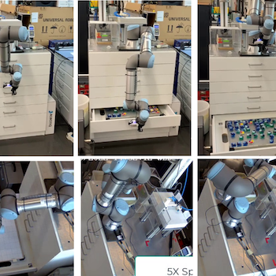
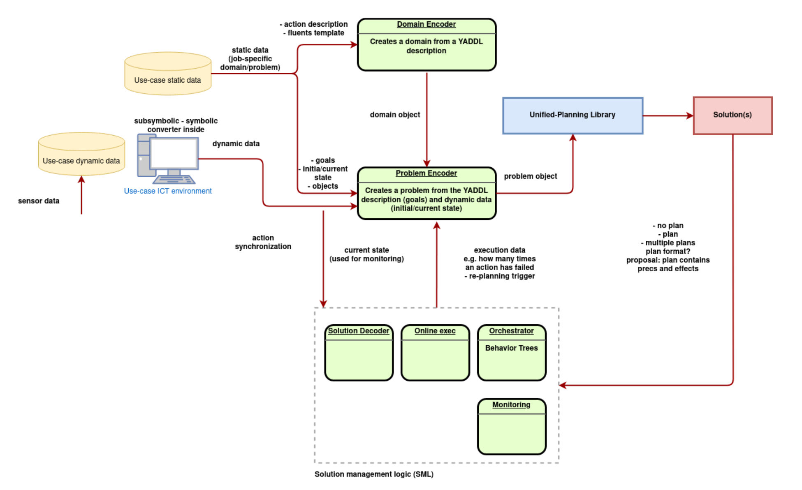

# Automated Experiment Design Domain

## Context

The 'Automated Experiment Design Domain TSB' aims at improving efficiency and flexibility of an industrial scenario at Procter&Gamble, where robots are employed to support people in the development of automated quality tests, considering in particular testing laundry detergent soluble pouches. 

Quality tests consist in measuring certain pouch features, such as weight, dimensions, film elasticity, tightness, strength (resistance to compression), and are typically carried out by a human operator cooperating with a robotic arm, using different measure instruments. Since instruments can operate with several settings (e.g., strength can be tested by applying constant compression force, constant compression rate, a mix of the two, etc.) and tests may need different settings, the overall procedure varies in each testing session.

Typical operations include:
- Picking up individual pouches from product containers
- Identifying pouches (production codes, production line, etc.) and labeling in the data system
- Deciding the sequence of tests to carry out, based on pouch type and project
- Placing each pouch in the specific instrument
- Setting up and operating the instruments
- Recording results
- Recording visual observations, such as possible breakage area or type of failure
- Disposing the pouch

Manually handling the overall procedure is a very intensive task, which may employ many people for entire days. Moreover, the robotic arm requires being re-programmed every time a change in the procedure is to be applied. 

The main goal of the 'Automated Experiment Design Domain' TSB is to demonstrate the effectiveness of AI planning technology integrated with robotics solutions in delivering a high number of robotics procedures for the various use-cases, while reducing manual operations and planning that currently limit flexibility and efficiency of the system. Moreover, the TSB aims at empowering non-robotics-experts to be able to customise, adapt, and change the course of the robotics procedures, using natural interfaces.

## Planning Problem Description

The planning problem requires to build a plan to handle all the operations to complete a testing procedure successfully. The problem models the activation of the available measure instruments together with their effects on the pouches and the actions the robotic arm can execute (opening the drawers containing the pouches, grasping a pouch, positioning a pouch on some instrumeent, etc.) The goal is defined as having successfully measured all the pouches with the required instruments. The main challenges are due to the high number of pouches (several hundreds) to be tested and the need to parallelize the actions in order to reduce execution time, while guaranteeing a reasonable planning time.

## Modeling in UP

The problem is modelled using the Unified Planning (UP) framework through the specification of predicates and actions needed to describe the application domain. The level of abstraction of predicates and actions has been tuned with a bottom-up approach, where procedures implementing predicate and action functionalities have been first developed and tested on the real scenario and in the simulator to guarantee applicability and then have been described as domain and problem specifications using the UP framework. Different domains and problems were defined, to show the flexibility of the solution. Also, in order to improve the solution effectiveness, both single-agent and multi-agent formalizations were used.

Two modeling approaches were considered. One uses Multi-Agent Planning which, by modeling the various measure instruments as distinct agents, 
naturally enables parallel and independent execution of the measure instruments, which in turn leads to significant saving in execution time, wrt sequential solutions, where instruments run sequentially.  As to the second, called 'post-parallelization' approach, in order to further increase the saving in execution time, instead of solving the original problem instance, a simplified version on a smaller number of pouches was solved with a single-agent sequential plan, and then several replicas of the resulting plan were combined in parallel, to obtain a plan able to deal with the original number of pouches. This latter approach resulted the most effective.

## Operation Modes and Integration Aspects

The `OneShotPlanner` mode was used to produce the solution plan. This is the simpolest way to obtain a plan for an input problem instance. The `Sequential Simulator` mode was used for combining and parallelizing the plans that solve the easier problems in the post-parallelization approach. The `Compiler` mode was used to switch from a multi-agent to a sequential representation of the problem in the post-parallelization approach.

The system architecture depicted below has been fully implemented and validated in the real environment with P&G facilities.

The system needs to interact with the Procter & Gamble data infrastructure to receive instructions and export generated results. Lab and plant operators enter into the corporate system the identification of all the samples to be measured and which specific measure and sequence need to be executed on each of them, as well as the priority of each sample. The planning system receives this stream of data via a dedicated API. The planning system continuously adapts the testing scheduling according to the received info. To perform the required lab measurements the robotics system interacts with the various instruments present in the testing unit, via an integration layer which has been implemented in ROS. Each instrument is now modelled as a ROS node, and exchanges commands and data via a messaging system. The central controller handles this stream of communication and exports the generated data, linked with the product IDs, to the P&G data systems via API connections. 

## Lessons Learned

Lessons learned include an approach to apply AI planning techniques to industrial scenarios in which an operational solution is already existing, but is not flexible and easily extensible. For example, it cannot be easily adapted to new situations or to achieve new goals.
In this context, we applied a methodology based on modularizing the existing solution and building (through an iterative process) an AI planning domain to describe the modules (in terms of actions) and their properties (as predicates and fluents). Such a planning domain can then be used to solve different problems varying initial states and goals, thus overcoming the difficulties arising from a non-flexible and non-modular solution. 
Modularity is a fundamental prerequisite to apply AI planning technology and, in turn, applying AI planning forces the development of modular domain-specific components.

## Resources
- [Automated Experiment Design Page](https://www.ai4europe.eu/business-and-industry/case-studies/automated-experiment-design)
- Video: [The Automated Experiment Design TSB at Work](https://drive.google.com/file/d/1GtYw0D-mhQpF1wzT9OEC6QrBxynaFU0k/view?usp=drive_link)

