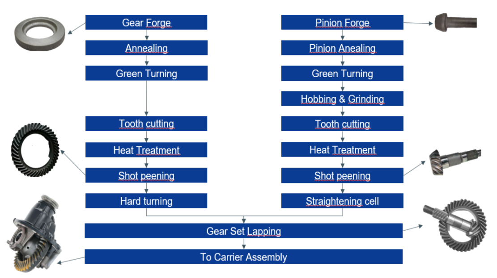

# Name of the application 

## Context

The [https://www.ai4europe.eu/business-and-industry/case-studies/planning-flexible-manufacturing](Flexible Manufacturing) usecase targets the automation on warehouse manufacturing processes. In this usecase, a set of axels must be created as an assembly of gears and pinions. Before being ready for assembly, gears and pinions must go through various steps independently. There exist many different types families or axels, and therefore of gears and pinions.  Families determine the machine that can be used for each processing step as well as the time it will take. 

The objective of the Flexible Manufacturing Technology Specific Bridge (TSB) is to provide an end-to-end system to 
1. Model the manufacturing process (families, steps, machines, durations, and associated constraints)
2. Given an input of batches to produce, provide a temporal plan that produces the required batches in a minimal amount of time given the constraints

## Planning Problem Description

The planning problem consists in a scheduling under resource constraint problem. The main goal of the system is to create a temporal plan that guarantees the production of the right pieces given constraints, using parallelization when possible. Ideally, the computed plan should be optimal and guarantee production as quickly as possibel. However, due to the high number of families and steps considered, this problem is computationally extremely expensive. 

## Modeling in UP

This usecase needs the use of temporal optimization with numerical constraints. To make this possible, the usecase has been leveraging the numerical fluents and durative actions provided by the UP. Fluents have been created to keep track the stock of raw material and pieces after each step. Machines have been modeled as objects, representing limited resources. Each step of the process has been modeled as a durative action, parameterized with the family to process and the machine used. Each action has the following preconditions: 
 - The number of pieces to be processed during this step is higher than the existing output stock
 - The machine can actually be used for the current step
 - The input stock for this step is higher than the amount of pieces to process
 - The machine to use is not currently in use

And each action has the following effects: 
 - At the beginning of the action, the machine is written as being in use
 - At the beginning of the action, the stock of pieces to be processed during this step is reduced by the capacity of the machine
 - At the beginning of the action, the input stock is reduced by the capacity of the machine
 - At the end of the action, the machine is written as not being in use
 - At the end of the action, the output stock is increased by the capacity of the machine

## Operation Modes and Integration Aspects

The TSB is composed of a six components, described in the table below. 

| Component | Description |
|-----------|-------------|
| Domain Knowledge | Contains the process and expert knowledge from the use-case expert about the manufacturing process, hard and soft constraints. Model this knowledge using UP’s objects, fluents, and operators.|
| Batch Model | Contains the data about the batched to be processed, inputted by a human operator | 
| Domain Encoder | Converts the data from the Batch model into a UP compatible format. |
| Problem Encoder | Creates the UP problem based on the domain knowledge and the domain encoder.| 
| Solution Decoder | Transform the plan generated by the UP in a human-readable format | 
| Orchestrator | Uses the problem encoder to generate the UP problem and generates a UP plan based on the given input. |
| Graphical User Interface | Allows the human operator to input information about the batches to be processed and display the generated plan |

To solve the modeled problem, the Flexible Manufacturing usecase made use of the `OneShopPlanning` operation mode of the UP. We experimented with the planners Tamer and LPG, which achieved similar performances. We finally settled for Tamer. 

## Lessons Learned

Modeling complex scheduling usecases in the UP is still complicated as the scheduling approach available at the time of this development did not allow for combining both temporal and numerical optimization. It remains possible to make use of operators and fluents, but at the cost of increased complexity. In addition, heuristics to tackle this type of problems are lacking and solving the modeled problem is extremely long. Finally, it may be difficult sometimes for someone with limited planning experience to understand which heuristic is actually used or which heuristic could be used for each type of problems. 

Nonetheless, the UP showed excellent flexibility and simplicity of use. Once modeling decisions had been made, implementing them using the UP was surprisingly fast. The possibility to switch almost seamlessly between planners made experiments and testing various approaches relatively easy. The limited amount of debugging messages provided by some planners was sometime frustrating, but the UP itself made for an excellent middleware. 

## Resources
- TSB Flexible Manufacturing [https://github.com/aiplan4eu/tsb-flexible-manufacturing](Github)
- AI4Experiment Demo (to be added)
