# FMAP: A Platform for the Development of Distributed Multi-Agent Planning Systems

# User Manual (ver. 1.0) 
---

FMAP is a cross-platform Java-based software for the development of Multi-Agent Planning (MAP) applications where several agents with planning capabilities must coordinate with each other in order to jointly synthesize a solution plan that solves a set of common goals. We assume non-deterministic environments and so the world only changes through the application of the actions of the agents. A *state* of the world is defined through a finite set of state variables, each associated to a finite set of mutually exclusive values. Agents have a *local view* of the world defined by their state variables and values. The variables/values of an agent which are not shared with the others are *private* to the agent and, consequently, they are not accessible to the remaining agents. 

FMAP works with a factored planning representation such that the input MAP task is decomposed in an individual planning task per agent. The task of an agent is comprised by a domain file that describes the domain knowledge of the agent and a problem file that contains the agent's local view of the initial state, the common goal as well as the information the agent can share with the others. 

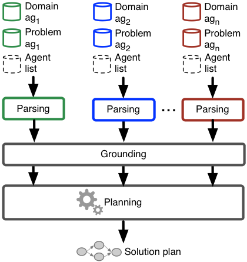

FMAP uses a distributed heuristic search strategy.  Each planning agent in the platform features an embedded search engine based on a forward partial-order planning scheme. In order to solve a MAP task, FMAP performs the three stages depicted in the above figure:

1. Parsing: agents lexically and syntactically analyze their domain and problem files and create several data structures to store the MAP task.

2. Grounding: this stage involves instantiating the variables of the planning actions, state variables and values of the agents' parsed tasks. During this stage, agents jointly build a distributed relaxed planning graph (*disRPG*) in order to generate only those grounded actions that are applicable at planning time.

3. Planning: after pre-processing the MAP task, agents carry out the planning procedure, which comprises the following steps:

	* Agents select an open node of the search tree for expansion accordingly to some heuristic estimate.
	* Agents individually expand the selected node using their embedded search engines. For example, agents in the below figure generate four successors from the root node, all of them containing one action contributed by the corresponding agent. Then, upon agreement on selecting the green circle node on the left, the individual expansion of this node results in five newly generated nodes. The new successors add one action to their parent node and are integrated in the joint search tree.
	* Once the successors are generated, agents remove the private information from the plans before communicating the node information to the others. Therefore, each agent in FMAP keeps a privacy-preserving copy of the joint search tree.

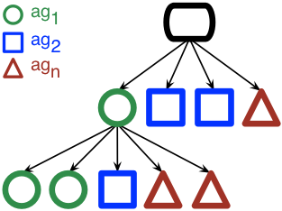

FMAP leverages a forward-chaining partial-order planner (POP) that allows agents to plan their actions in parallel whenever possible, which largely improves the quality of the resulting solution plans. Moreover, the forward-chaining approach relies on the *frontier state* (state that results from executing the actions of a node) to compute accurate state-based estimates.

The FMAP platform makes extensive use of Java *interfaces*, which encapsulate the different components of the code, enabling for an easy replacement of the existing algorithms. This feature greatly simplifies the arduous task of developing and integrating new distributed planning algorithms and heuristic functions. Additionally, FMAP includes a thoroughly-tested communication infrastructure that allows for the exchange of synchronous and asynchronous messages.

Along with the present user manual, the FMAP repository includes the [complete *Javadoc* documentation of the source code](https://altorler.bitbucket.io/fmap/). Moreover, a comprehensive collection of MAP domains encoded with the FMAP language is included in the */Domains/* directory of the repository. FMAP is also compatible with the *factored* benchmarks of the [2015 CoDMAP competition](http://agents.fel.cvut.cz/codmap/domains/all.zip). 

## Running FMAP ##
---

The **FMAP.jar** file, located in the root folder of the FMAP repository, is an executable file that runs the FMAP platform. FMAP includes two different modes of operation; namely, a **command-line** mode and a graphical **interactive** mode.

### FMAP command-line mode ###
---

The command-line mode of FMAP is launched by executing the *jar* file of the platform along with several parameters:

	java -jar FMAP.jar [agent-name agent-domain.pddl agent-problem.pddl]+ agent-list.txt

For each agent, the user must enter the following information:

* *agent-name*: name of the agent, as described in the objects section of the agent's problem file.
* *agent-domain.pddl*: domain file of the agent. 
* *agent-problem.pddl*: problem file of the agent.

An *agent-list.txt* file must also be provided. This file comprises the names and IP addresses of the participating agents:

*agent1 ip_address_agent1*

*agent2 ip_address_agent2*

*…*

Additionally, the user can enter the following optional parameters in order to configure the search procedure:

* `-s N` selects the search strategy of FMAP. Currently, the platform supports only an *A search* scheme, which is the default value of the tag `-s` (`-s 0`). However, the FMAP platform is extendible with new user-defined search strategies.

* `-h N` selects the heuristic function(s) used to evaluate the quality of the plans. Currently, the following values for `N` are supported:
	* `0` - *FF heuristic*: guides the search through the well-known *h_FF* heuristic function. Currently, this option is available for single-agent planning tasks only.
	* `1` - *DTG heuristic*: evaluates plans via the heuristic *h_DTG*.
	* `2` - **default option** - *DTG + Landmarks*: this option applies  the multi-heuristic search scheme of the MH-FMAP solver (see related publications below) by combining the *h_DTG* and *h_Land* heuristics to guide the search.
	* `3` - *Inc. DTG + Landmarks*: incremental multi-heuristic mode that makes use of *h_DTG* and *h_Land*. 

Finally, the instruction `java -jar FMAP.jar --help` displays the command-line help.

For example, in order to run the *driverlog pfile4* task included in the *Domains* folder of the FMAP distribution on a single machine, the following command must be introduced:

`java -jar FMAP.jar driver1 Domains/driverlog/Pfile4/DomainDriverlog.pddl Domains/driverlog/Pfile4/ProblemDriverlogdriver1.pddl driver2 Domains/driverlog/Pfile4/DomainDriverlog.pddl Domains/driverlog/Pfile4/ProblemDriverlogdriver2.pddl driver3 Domains/driverlog/Pfile4/DomainDriverlog.pddl Domains/driverlog/Pfile4/ProblemDriverlogdriver3.pddl agent-list.txt`

The *agent-list.txt* file is encoded as follows (note that 127.0.0.1 is the *localhost* or *loopback* address):

*driver1 127.0.0.1*

*driver2 127.0.0.1*

*driver3 127.0.0.1*

The command-line mode of FMAP allows the user to execute a MAP task in multiple hosts, running several agents in each host. In order to execute the *driverlog pfile4* task in two different machines with associated IP addresses 100.100.100.1 and 100.100.100.2 (assuming that agents *driver2* and *driver3* are allocated on host 100.100.100.2), the following commands must be introduced:

* Host 1: `java -jar FMAP.jar driver1 Domains/driverlog/Pfile4/DomainDriverlog.pddl Domains/driverlog/Pfile4/ProblemDriverlogdriver1.pddl agent-list.txt`
* Host 2: `java -jar FMAP.jar driver2 Domains/driverlog/Pfile4/DomainDriverlog.pddl Domains/driverlog/Pfile4/ProblemDriverlogdriver2.pddl driver3 Domains/driverlog/Pfile4/DomainDriverlog.pddl Domains/driverlog/Pfile4/ProblemDriverlogdriver3.pddl agent-list.txt`

The *agent-list.txt* file must include the IP addresses of each agent's host:

*driver1 100.100.100.1*

*driver2 100.100.100.2*

*driver3 100.100.100.2*

In this mode, the solution plan is returned in the format of the [2015 CoDMAP distributed track](http://agents.fel.cvut.cz/codmap/), which is compatible with the [VAL](https://nms.kcl.ac.uk/planning/software/val.html) plan validator.

## FMAP graphical interactive mode ##
---

Executing the *jar* file of the platform without providing any optional parameters (`java -jar FMAP.jar`) activates the graphical interactive mode of FMAP. In the interactive mode, agents are launched on a single host only.

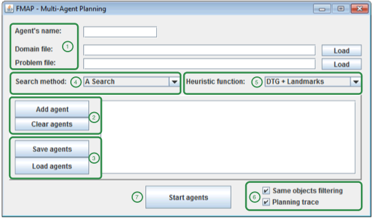

In order to execute a planning task through the graphical interface (for instance, the *driverlog pfile2* task), the user must introduce the following information:

1. The basic fields *Agent's name*, *Domain file* and *Problem file* allow to enter the basic information of each agent in the MAP task.
2. Once the agent's information is provided, the agent is registered via the *Add agent* button. The *Clear agents* button clears the current selection.
3. The task configuration can be saved in a file through the *Save agents* button. 
This file can be later used to load all the agents of the task at once via the *Load agents* button.
4. The field *Search method* is a drop-down menu that displays the available search strategies to solve the MAP task. As discussed in the previous section, the current FMAP configuration only includes the *A Search* method, but new user-defined search strategies can be included in this menu. 
5. The heuristic function(s) for the evaluation of the plans is chosen via the *Heuristic function* drop-down menu. The default option is *DTG + Landmarks*. The current version of the platform also supports *DTG*, *FF* and *Inc. DTG + Landmarks*. 
6. The bottom right checkboxes allow the user to configure additional options: *Same objects filtering* removes the *same objects* of the task, and *Planning trace* activates/deactivates the planning trace printed by the agents.
7. Once the configuration is completed, the *Start agents* button launches the planning agents and starts the task-solving process.

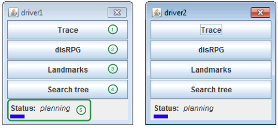

For each agent in the MAP task, an *Agent menu* like the one shown in the above figure is displayed.  The interface of an agent includes several options (highlighted by the green numbers in the above figure) to visualize the different data structures managed by the agent during the task-solving process:

1. The *Trace* option of the *Agent menu* is used to print a log of the agent planning trace, which includes the plans built at each iteration of the search as well as the plans received from the remaining agents. Double-clicking on the name of a plan graphically displays it in the *Search tree* viewer.
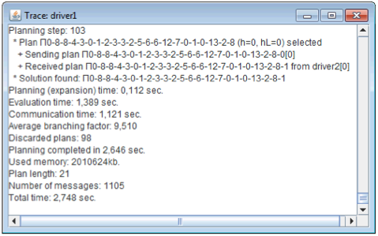
2. The *disRPG* option of the *Agent menu* displays the distributed relaxed planning graph jointly computed by the planning agents at grounding time. The disRPG alternates levels of actions and fluents. Fluents are labelled with the names of the agents that achieve them.
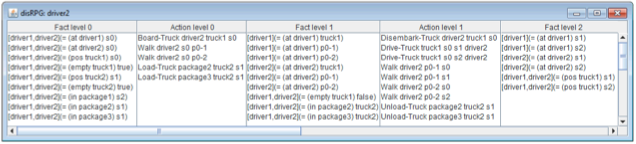
3. The *Landmarks* viewer is activated when clicking on the *Landmarks* option of the *Agent menu*. White nodes in the screenshot below represent *single landmarks*, while grey nodes stand for *disjunctive landmarks*. The edges indicate *necessary orderings* among landmarks.
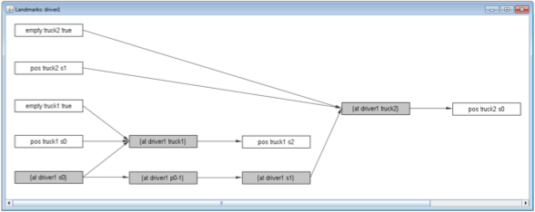
4. The *Search tree* option of the *Agent menu* displays the search tree viewer. The left-hand side of the viewer showcases the search tree. Nodes with successors are marked with a folder icon. Clicking on a folder icon unfolds the node contents and displays its direct successors. By clicking on a particular node, the associated plan is shown on the right-hand viewer. Zooming in/out the graphical representation of a plan is done via the mouse wheel. For an optimal visualization of the graph, the action nodes can be shifted via drag-and-drop. Finally, double-clicking on an action, ordering or causal link displays its associated information.
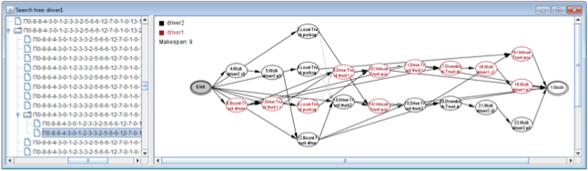
5. The *Status* field at the bottom of the *Agent menu* is a progress bar that indicates the current stage of the task-solving process. States include *parsing*, *grounding*, *planning*, *idle* (which is displayed once a solution is found) and *error* (which is shown in case that an error occurs). The *Status* bar and its color indicate the progress of the search according to the best heuristic value obtained so far. In case the search is stuck in a *plateau*, the bar will progressively get a red tone; otherwise, the progress bar will be visualized in blue.

## Use cases ##
---

This section provides some use cases that describe the behaviour of the FMAP platform when solving a MAP task under different configurations.

### Running *driverlog pfile2* task with the command-line mode and default options ###
---

In order to run the 2-agent *driverlog pfile2* task with the command-line mode, we execute the *jar* file of the platform, *FMAP.jar*, along with the routes of the domain and problem file of each agent as well as the *agent-list.txt* file: 

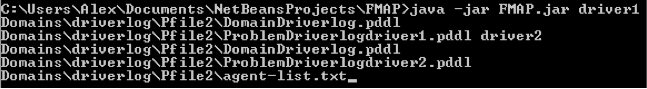

Once the task is solved, the platform will print out the solution plan in the format of the [distributed CoDMAP track](http://agents.fel.cvut.cz/codmap/), which is compatible with the [VAL](https://nms.kcl.ac.uk/planning/software/val.html) plan validator:

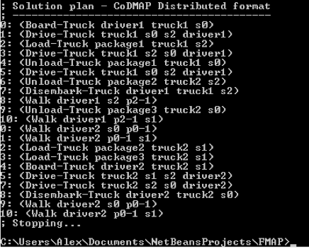

As shown in the above screenshot, each line of the solution plan includes a timestamp and an action. The rest of lines preceded by a ';' symbol are comments ignored by the plan validator [VAL](https://nms.kcl.ac.uk/planning/software/val.html).

### Running *driverlog pfile2* task with the command-line mode and the DTG heuristic ###
---

In this use case, we want to solve the *driverlog pfile2* task with the command line mode using the *h_DTG* heuristic to guide the search. To do so, we run FMAP with the additional parameter `-h 1`:

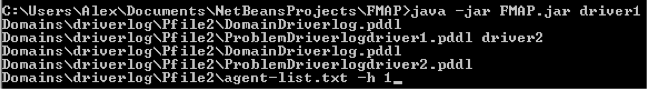

Following the above command, the platform will run a multi-agent A search guided by *h_DTG*, which will lead to the following solution plan:

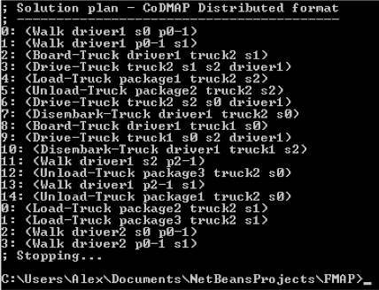

### Running *rovers pfile3* task with the graphical interactive mode and default options ###
---

In this use case, we will execute the *rovers pfile3* task with the graphical interactive mode and the default parameters of FMAP. First, we activate the interactive mode by executing the jar file of the platform with no additional parameters: 

`java -jar FMAP.jar`

The task *pfile3* of the *Rovers* domain includes 2 different agents, *rover0* and *rover1*. First, we enter the information of *rover0* (agent name, domain file and problem file) in the main window of FMAP:

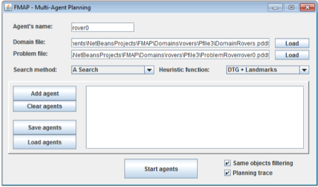

In order to have the agent *rover0* registered in the system, we press the *Add agent* button. We follow the same steps to register agent *rover1*:

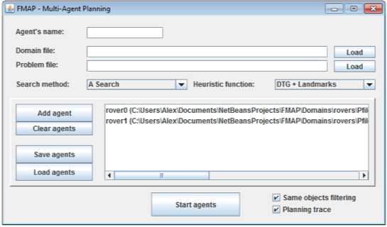

Optionally, the information of the agents can be saved into a file by clicking on the *Save agents* button, which will enable to directly load the task via the *Load agents* button in future usages of the platform.

Once the parameters of the task have been set, the *Start agents* button initiates the task-solving process, and displays the *Agent menu* windows of *rover0* and *rover1*. As previously discussed, the task execution can be monitored through the *Agent menu* of each agent. Once the agents reach a solution plan, the *idle* status will appear in the *Agent menu* of both agents. The solution plan obtained by FMAP is accessible via the *Trace* menu:

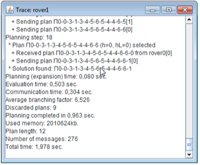

Double-clicking on the name of the solution plan in the *Trace* menu (the plan name that appears after *Solution found* in the above figure) returns a graphical visualization of the plan in the *Search tree* menu: 

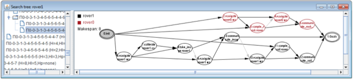

### Running *rovers pfile3* task with the graphical interactive mode and the DTG heuristic ###
---

In this use case, we execute again the *rovers pfile3* task with the graphical interactive mode. Since we stored the task configuration in a file in the previous example, we can now make  use of such a file and load the *driverlog pfile3* task configuration at once via the *Load agents* button. Next, we select the *DTG* option from the *Heuristic function* drop-down menu and launch the execution of the task via the *Start agents* button: 

Again, the solution plan obtained by agents *rover0* and *rover1* can be accessed by double-clicking on the name of the plan in the *Trace* menu, which will graphically display the solution in the *Search tree* viewer:

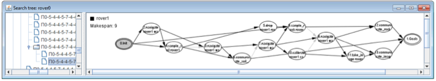

## Extending the platform ##
---

FMAP is designed as an extendible software platform that allows the user to create additional multi-agent planning strategies. The platform uses *Java interfaces* to seamlessly integrate new search methods and heuristic functions.

The following subsections describe the steps to follow when integrating a new search method and a new heuristic function in the platform, respectively.

### Adding a new search method ###
---

In order to create a new search method, we will first add the name of the new method to the `SEARCH_METHODS` array of the `PlannerFactory` class (package `common.map_planner`). Then, a constant numeric identifier must be assigned to the method in the `PlannerFactory` class. The following screenshot shows the inclusion of a new search method named `Custom Search`, with an associated identifier `CUSTOM_SEARCH = 1`:

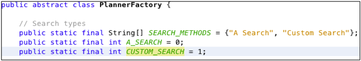

Next, the user will indicate the heuristic functions that are incompatible with the new search method in the `CheckSearchConstraints()` method of the `PlannerFactory` class. This way, the platform will return an error if a user attempts to combine such search method and heuristic function. In the screenshot below, we document an incompatibility between the `Custom Search` method and the *h_FF* heuristic function:

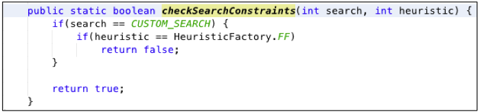

The new search method will be included in the `service.map_planner` package as a new class that implements the interface `common.map_planner.POPSearchMethod`. The next screenshot showcases the new class `CustomSearchMethod`:

Finally, the `createPlanner()` method of the `PlannerFactoryImp` class (package `service.map_planner`) must be edited to create an object of our new class when the value of `searchType` matches the identifier of the search method. For example, if `searchType == CUSTOM_SEARCH`, the planner will be initialized with an object of the class `CustomSearchMethod` as a search method.

### Adding a new heuristic function ###
---

Integrating a new user-defined heuristic is carried out similarly as integrating a search method. In the `HeuristicFactory` class (package `common.map_heuristic`), the user will register the new heuristic by adding its name in the `HEURISTICS` array and assigning it a numeric identifier. In the following screenshot, we have added a new heuristic function named `Custom Heuristic` with an associated identifier `CUSTOM = 4`:

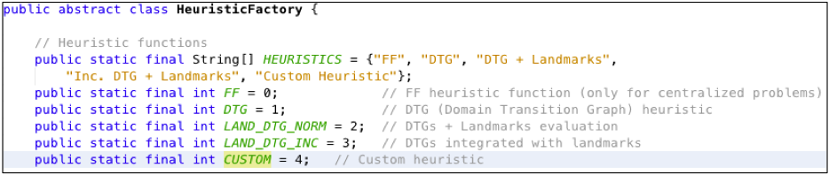

As described in the previous subsection, incompatibilities between the new heuristic and the existing search methods are documented in the `CheckSearchConstraints()` method of the `PlannerFactory` class.

The new heuristic function will be encoded within the `service.map_heuristic` package as an implementation of the `common.map_heuristic.Heuristic` interface. The next screenshot shows the class `CustomHeuristic` that implements our new heuristic function:

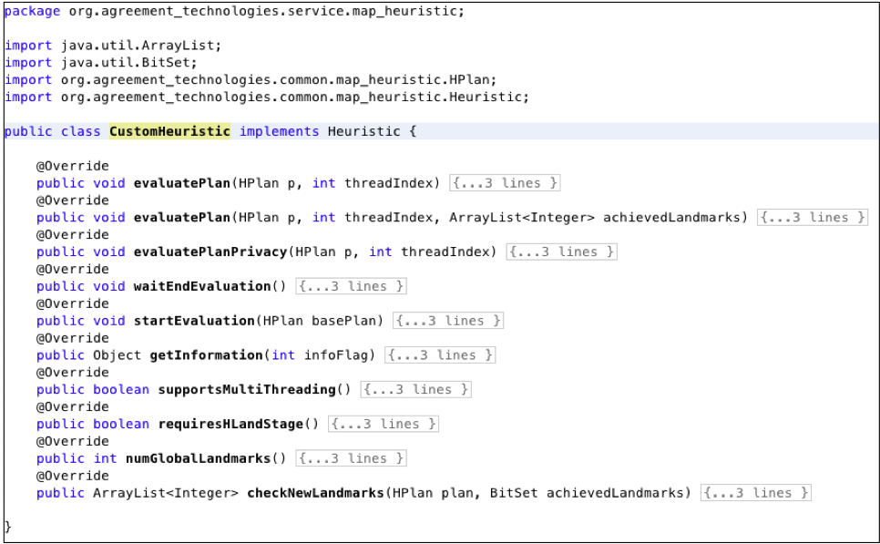

Finally, the method `getHeuristic()` of the `HeuristicFactoryImp` class (`service.map_heuristic` package) will be modified in order to create and return an object of the new heuristic function in case that the value of the `heuristic` parameter matches the identifier of the corresponding heuristic function. For instance, if `heuristic == CUSTOM`, `getHeuristic()` will return an object of the class `CustomHeuristic`.

#### Example heuristic function ####
---

The source code of an example heuristic function that evaluates plans according to the number of pending (non-reached) goals can be found [here](https://altorler.bitbucket.io/fmap/examples/PendingGoalsHeuristic.java).

## Javadoc API description ##
---

The complete Javadoc description of FMAP's API can be accessed [here](https://altorler.bitbucket.io/fmap/).

## Related publications ##
---

The following papers describe existing MAP systems developed under the FMAP platform:

* Jaume Jordán, Alejandro Torreño, Mathijs de Weerdt, Eva Onaindia. 
**A Better-Response Strategy for Self-Interested Planning Agents**. 
Applied Intelligence, DOI 10.1007/s10489-017-1046-5, (2017)

* Alejandro Torreño, Eva Onaindia, Óscar Sapena. 
**Global Heuristics for Distributed Cooperative Multi-Agent Planning**. 
25th International Conference on Automated Planning and Scheduling (ICAPS'15), pp. 225-233, (2015)

* Alejandro Torreño, Eva Onaindia, Óscar Sapena. 
**FMAP: Distributed Cooperative Multi-Agent Planning**. 
Applied Intelligence, Vol. 41(2), pp. 606-626, (2014)

* Alejandro Torreño, Eva Onaindia, Óscar Sapena. 
**A Flexible Coupling Approach to Multi-Agent Planning under Incomplete Information**. 
Knowledge and Information Systems, Vol. 38(1), pp. 141-178, (2014)

* Alejandro Torreño, Eva Onaindia, Óscar Sapena. 
**FMAP: A Heuristic Approach to Cooperative Multi-Agent Planning**. 
ICAPS'13 DMAP Workshop on Distributed and Multi-Agent Planning, pp. 84-92, (2013)

This article surveys the state-of-the-art approaches to cooperative MAP, including the FMAP platform:

* Alejandro Torreño, Eva Onaindia, Antonín Komenda, Michal Stolba. 
**Cooperative Multi-Agent Planning: A Survey**. 
ACM Computing Surveys, Vol. 50(6), (2017)

## Contact ##
---

For technical assistance, please contact the authors of this software at (replace AT by @): 

* *altorler AT upvnet.upv.es* 
* *osapena AT dsic.upv.es* 